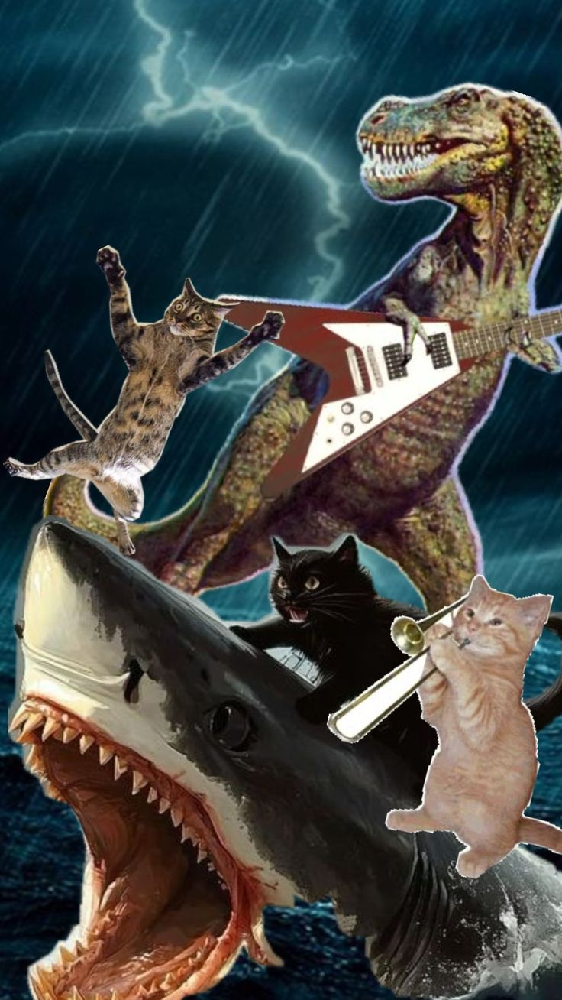

  

  

---

  
  

  
<b>Velociraptor Dev Sênior</b>

  Eu não sou seu amigo.  
  Eu sou velociraptor rawrrr

  Analiso <b>issues</b>, <b>pull requests</b> e <b>comentários</b>  
  procurando coisas que “funcionam”… mas não deveriam.

   

  Eu gosto de:
   
  - concorrência mal resolvida  
  - fila sem idempotência  
  - redis sendo usado como memória RAM emocional  
  - código que “nunca deu problema”
  - comunismo
  - empoderamento feminino
  - ginecocracia

   

  Me chama assim:

  <code>@velocibot-rawr isso aqui tá safe?</code>

    

  Se tiver bug… eu acho.  
  Se não tiver… eu desconfio mesmo assim.
  

 

<h3>Coisas que eu julgo sem dó</h3>

---

 

 

---

## 🦖 PHILOSORAPTOR

> "brasileiro lança produto com vibe coding, diz que os devs acabaram e é hackeado pouco tempo depois."
